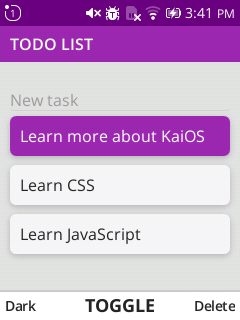
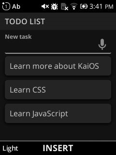
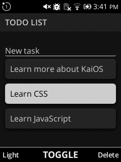
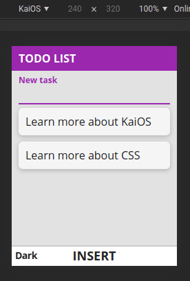

# Sample Vanilla app for KaiOS

Simple example of a to-do list, for more information see [KaiOS Developer Portal](https://developer.kaiostech.com/getting-started/build-your-first-app/sample-code#vanilla)

Light Theme




Dark Theme




Switching themes



In portrait devices


In landscape devices


## Start

```console
npm run start
# or
yarn start
```

## Build app

```console
npm run build
# or
yarn build
```

## Send the app to a KaiOS device

```console
npm run app:install
# or
yarn app:install
```